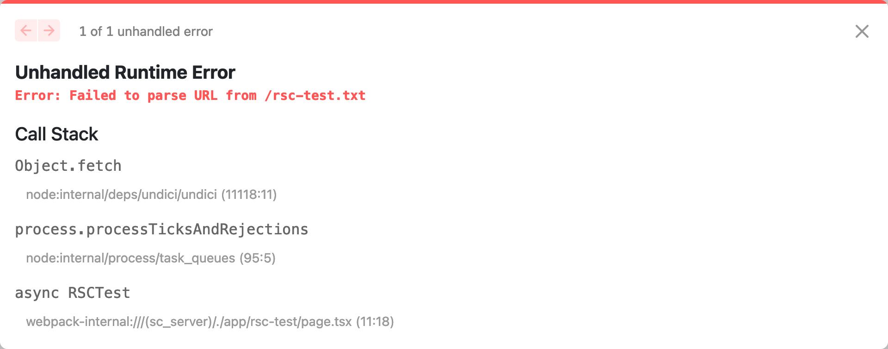
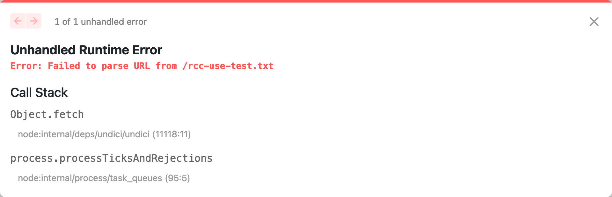
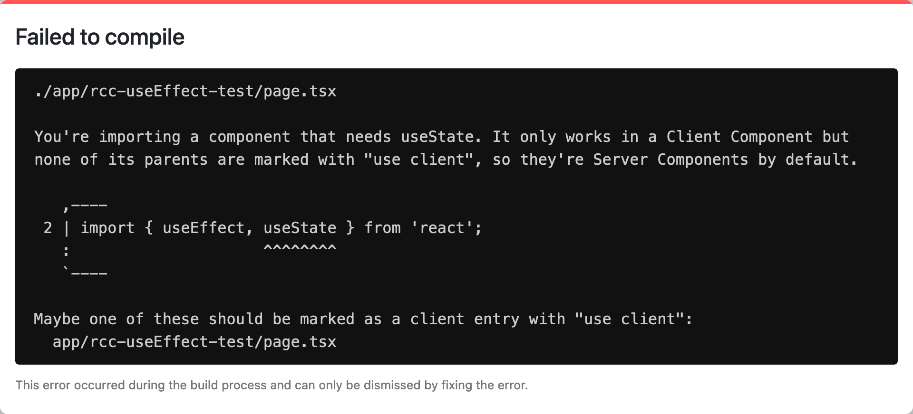

# Next 13 Static Site Generation

This repository exists for me to try out how Next 13, the at the time of writing
latest Next beta version, affects static site generation in Next.

I am working off of the Next 13 beta docs here:
https://beta.nextjs.org/docs

To scaffold a Next 13 beta app, this command was used:
`npx create-next-app@latest --experimental-app`

The application is named `test` and TypeScript and ESLint are both used.
I hoisted the contents of the `test` directory to the repository directory.

To run, use `npm run dev`.
The site is accessible at http://localhost:3000.

I am using the unstable `app` API as opposed to the classic `pages` one.
I removed the default `pages/api/hello` route to not confuse SSG/`next export`.

I created several routes each exhibiting and error I was unable to solve and
think is a problem with Next as I am doing things what I would consider to be
the obvious way and the errors I am getting are not leading me to solutions or
documentation explaining the limitations, but instead show cryptic inscrutable
messages that seem internal to Next.

All these errors stem from trying to include a resource in `public` into the
page.
Ideally, I would do this at build time, but I was not able to get it to work
even at runtime…

## Attempting to use RSC with SSG

I thought I would be able to use RSC and use `async`/`await` to call `fetch` on
the additional resouces I want to bring in.
I created a route named `rsc-test` for this.

I used this code:

```javascript
import Link from 'next/link';

export default async function RSCTest() {
  const text = await fetch('/rsc-test.txt').then(response => response.text());
  return (
    <>
      <header>
        <Link href="">« Home</Link>
      </header>
      {text}
    </>
  );
}
```

I got this error:

> Error: Failed to parse URL from /rsc-test.txt



I have filed this issue for this: https://github.com/vercel/next.js/issues/42760

The suggested solution is to use `fs` and read the file the Node way.
I applied this suggestion and it works, but it is worth noting that `public/`
must be used unlike when using `fetch` in RCC.

However, with this fix applied, SSG is still not working:

> PageNotFoundError: Cannot find module for page: /

Somehow the landing page now presents an error.

## Attempting to use RCC with `use` with SSG

Not being able to use RSC, I figured I'd just use RCC with the new `use` React
hook so that I can avoid `useEffect`.
I created a route named `rcc-use-test` for this.

I used this code:

```javascript
import Link from 'next/link';
import { use } from 'react';

export default function RCCUseTest() {
  const text = use(fetch('/about.txt').then(response => response.text()));

  return (
    <>
      <header>
        <Link href="">« Home</Link>
      </header>
      {text}
    </>
  );
}
```

I got this error:

> Error: Failed to parse URL from /rcc-use-test.txt



I have filed this issue for this: https://github.com/vercel/next.js/issues/42761

## Attempting to use RCC with `useEffect` with SSG

Since I was not able to use RSC or the new `use` hook, I figured I'd rever to 
the old way of doing things and use `useEffect` to run my `fetch`.
I created a route named `rcc-useEffect-test` for this.

I used this code:

```javascript
import Link from 'next/link';
import { useEffect, useState } from 'react';

export default function About() {
  const [text, setText] = useState('');
  useEffect(() => {
    void async function () {
      const response = await fetch('/rcc-useEffect-test.txt');
      const text = await response.text();
      setText(text);
    }()
  }, []);

  return (
    <>
      <header>
        <Link href="">« Home</Link>
      </header>
      {text}
    </>
  );
}
```

I got an error about `'use client'`.



It seems `useState` doesn't run in RSC?
I was not required to add `'use client';` in the previous RCC case?
With `'use client';` added, the application finally started working in
development mode.

I patched `package.json` to run `next export` after `next build`:

```diff
- "build": "next build",
+ "build": "next build && next export",
```

Next up I ran `npm dev build` to get a SSG version of the site where at least
the `useEffect` route should work.

I ran into build failures due to the two broken routes so I decided to remove
them and re-run.

This led to yet another error!
This time I got this error:

> PageNotFoundError: Cannot find module for page: /rcc-useEffect-test

I am guessing `next export` is not fully upgraded to handle the `app` Next API
yet?

## Attempting to use RCC with `use` & `'use client';` with SSG

Seeing what I saw in the previous section I decided to try using `use` again
but also add `'use client';` atop the component file.

I used this code:

```javascript
'use client';

import Link from 'next/link';
import { use } from 'react';

export default function RCCUseTest() {
  const text = use(fetch('/rcc-use-test.txt').then(response => response.text()));

  return (
    <>
      <header>
        <Link href="">« Home</Link>
      </header>
      {text}
    </>
  );
}
```

I got the same error:

> Error: Failed to parse URL from /rcc-use-test.txt

However, this time, the page was completely blank and I only saw that error in
the CLI.

I have filed this issue for this: https://github.com/vercel/next.js/issues/42762

## Retesting with the canary build

I switched to the canary build of Next (`npm install next@canary`) and the `use`
hook started working!

But… Only when using the `Link` from the landing page, not when accessing the
route directly in the browser, in that case, the same error remains.
